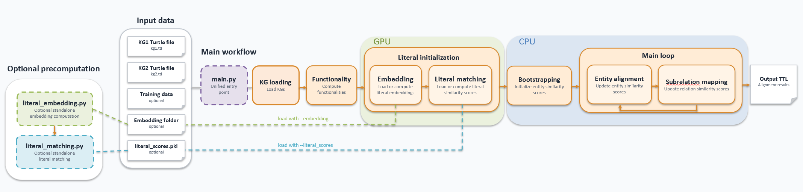

# FLORA

_This repository contains a Python implementation of [FLORA: Unsupervised Knowledge Graph Alignment by Fuzzy Logic](https://suchanek.name/work/publications/iswc-2025.pdf), best paper award at ISWC 2025._


FLORA is an unsupervised system for automatic knowledge graph (KG) alignment, jointly matching entities and relations in one KG to their equivalents in another.

## This Version

This version keeps the original FLORA algorithmic structure and logic, but adds several engineering improvements for larger KGs:

- FAISS-based literal matching, including exact flat search and approximate HNSW search.
- Optional IDF weighting for frequent literals.
- Optional compact KG storage based on read-only memory-mapped arrays for large datasets.
- Multiprocessing controls for bootstrapping, entity alignment, and subrelation mapping.

## Installation

Clone this repository and set up the base environment via `requirements.txt`. FLORA supports Python >= 3.9 and < 3.12.

```bash
conda create -n flora python=3.10
conda activate flora
pip install -r requirements.txt
```

Literal matching also requires FAISS, which is installed separately so you can choose the CPU or GPU build for your machine.

For CPU FAISS:

```bash
pip install "faiss-cpu>=1.9.0,<2.0"
```

For GPU FAISS, conda is recommended:

```bash
conda install -c pytorch -c nvidia -c conda-forge "faiss-gpu>=1.9.0,<2.0"
```

Use either `faiss-cpu` or `faiss-gpu`, not both. GPU FAISS is recommended for large kgs.

## Running FLORA

Run the commands below from the `src/` directory:

```bash
cd src
```

### Quick Toy Example

```bash
python main.py \
  --dataset small-test/mini/ \
  --embedding emb/mini/ \
  --output ../save/mini-test.ttl
```

### Custom Turtle Files

For custom KGs, pass the Turtle files explicitly:

```bash
python main.py \
  --kg1 ../data/my_dataset/kg1.ttl \
  --kg2 ../data/my_dataset/kg2.ttl \
  --embedding ../data/emb/my_dataset/ \
  --output ../save/my_dataset.ttl
```

Input KGs should be in Turtle format.

### Precomputing Literal Embeddings

Literal embeddings can be computed independently from the main FLORA loop. Because literal embedding computation benefits from GPU acceleration, while the main loop of FLORA needs only CPUs.


```bash
python literal_embedding.py \
  ../data/my_dataset/kg1.ttl \
  ../data/my_dataset/kg2.ttl \
  ../data/emb/my_dataset/ \
  --embedding_model Lihuchen/pearl_small
```

By default, literal extraction uses a fast scanner for large one-triple-per-line Turtle files. If your files use more general Turtle syntax, switch to FLORA's Turtle parser:

```bash
python literal_embedding.py \
  ../data/my_dataset/kg1.ttl \
  ../data/my_dataset/kg2.ttl \
  ../data/emb/my_dataset/ \
  --literal_parser turtle
```

To reuse the precomputed embeddings, pass the same folder to the main run:

```bash
python main.py \
  --kg1 ../data/my_dataset/kg1.ttl \
  --kg2 ../data/my_dataset/kg2.ttl \
  --embedding ../data/emb/my_dataset/ \
  --output ../save/my_dataset.ttl
```

### Precomputing Literal SameAs Scores

Literal SameAs scores can also be computed independently. Because faiss-based literal matching benefits from GPU acceleration, while the main loop of FLORA needs only CPUs. 
Run this after literal embeddings have been created, unless you use `--string_identity`:

```bash
python literal_matching.py \
  --kg1 ../data/my_dataset/kg1.ttl \
  --kg2 ../data/my_dataset/kg2.ttl \
  --embedding ../data/emb/my_dataset/ \
  --output ../data/literal_scores/my_dataset_literal_scores.pkl \
  --init 0.7 \
  --literal_faiss_index hnsw
```

As with literal embeddings, `--literal_parser fast` is the default for one-triple-per-line Turtle files. Use `--literal_parser turtle` for general Turtle parsing.

To reuse the precomputed scores, pass the pickle file to the main run. When `--literal_scores` is provided, FLORA loads these scores directly and skips literal embedding and literal matching precomputation:

```bash
python main.py \
  --kg1 ../data/my_dataset/kg1.ttl \
  --kg2 ../data/my_dataset/kg2.ttl \
  --literal_scores ../data/literal_scores/my_dataset_literal_scores.pkl \
  --output ../save/my_dataset.ttl
```

### Large-KG Options

For larger kgs, start with compact storage and explicit worker counts:

```bash
python main.py \
  --kg1 ../data/my_large_kg/source.ttl \
  --kg2 ../data/my_large_kg/target.ttl \
  --embedding ../data/emb/my_large_kg/ \
  --output ../save/my_large_kg.ttl \
  --alpha 3.0 \
  --init 0.7 \
  --compact_kg \
  --workers 40 \
  --bootstrap_workers 40 \
  --subrelation_workers 40
```

If seed alignments are available, pass them with `--trainingdata`. This path is resolved under `../data/`:

```bash
python main.py \
  --kg1 ../data/my_large_kg/source.ttl \
  --kg2 ../data/my_large_kg/target.ttl \
  --embedding ../data/emb/my_large_kg/ \
  --trainingdata my_large_kg/train_links \
  --output ../save/my_large_kg-supervised.ttl
```

Logs are written to `../save/logs/`.

## Reproducing the Experiments

FLORA uses datasets from:

- [OpenEA](https://github.com/nju-websoft/OpenEA): `D_W_15K_V1`, `D_W_15K_V2`
- [DBP15K](https://github.com/nju-websoft/JAPE): `fr_en`, `ja_en`, `zh_en`
- [OAEI KG Track](https://oaei.ontologymatching.org/2024/knowledgegraph/index.html): `memoryalpha-stexpanded`, `starwars-swtor`

Due to memory limitations, all datasets and pretrained embeddings used in the paper are on the [drive](https://nextcloud.r2.enst.fr/nextcloud/index.php/s/xj3oStmzLcknicr?opendetails=). Download and unzip all files in the data folder.

Example:

```bash
cd src
python main.py \
  --dataset OpenEA/D_W_15K_V2/ \
  --embedding emb/D_W_15K_V2/ \
  --alpha 3.0 \
  --init 0.7 \
  --output ../save/results/dw-v2.ttl
```

## Evaluation and Analysis

Alignment outputs are written to the path given with `--output`, commonly under `save/results/`. For evaluation and analysis, use the notebooks or scripts in the repository.

## Attribution and License

This codebase is adapted from the [original FLORA implementation](https://github.com/dig-team/FLORA) by Yiwen Peng, Thomas Bonald, and Fabian Suchanek. 
The code is licensed under the Creative Commons Attribution 4.0 International License (CC BY 4.0). 

## Citation

If you use this project for academic purposes, please cite the FLORA paper:

```bibtex
@inproceedings{FLORA,
    title = "FLORA: Unsupervised Knowledge Graph Alignment by Fuzzy Logic",
    author = "Peng, Yiwen and Bonald, Thomas and Suchanek, Fabian",
    booktitle = "International Semantic Web Conference (ISWC)",
    year = 2025
}
```