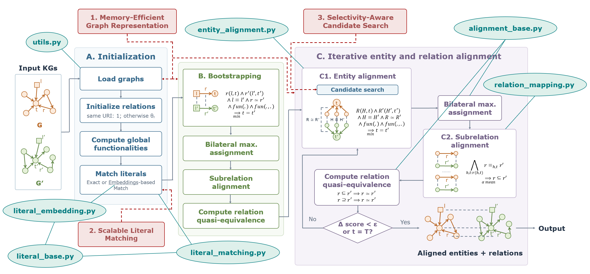

# FLORA+

This repository provides the Python implementation of FLORA+.
FLORA+ is an efficient and scalable method for jointly aligning entities and relations across knowledge graphs. It builds on FLORA's unsupervised fuzzy-logic reasoning framework, with optimizations that reduce runtime and memory consumption on large-scale KGs.

## FLORA

FLORA+ builds on [FLORA: Unsupervised Knowledge Graph Alignment by Fuzzy Logic](https://suchanek.name/work/publications/iswc-2025.pdf), best paper award at ISWC 2025.


FLORA is a simple yet effective method that (1) is unsupervised, i.e., does not require training data, (2) provides a holistic
alignment for entities and relations iteratively, (3) is based on fuzzy logic and thus delivers interpretable results, (4) provably converges, (5) allows dangling entities, i.e., entities without a counterpart in the other KG, and (6) achieves state-of-the-art results on major benchmarks.

FLORA extends [PARIS](https://github.com/dig-team/PARIS) system, which had three key limitations: (1) no convergence guarantees, (2) poor performance when functional relations are absent, and (3) the inability to see literal similarities beyond a strict identity.

## This Version - FLORA+

This version keeps the original FLORA algorithmic structure and logic, but adds several optimizations for larger KGs:

- Compact KG storage based on read-only memory-mapped arrays for large datasets.
- FAISS-based literal matching, including exact flat search and approximate HNSW search.
- Optional IDF-based literal filtering for frequent literals.
- Selectivity-aware candidate search to prune costly, low-selectivity expansions.
- Multiprocessing controls for bootstrapping, entity alignment, and subrelation mapping.

## Installation

Clone this repository and set up the base environment via `requirements.txt`. FLORA+ supports Python >= 3.9 and < 3.12.

```bash
conda create -n flora python=3.10
conda activate flora
pip install -r requirements.txt
```

The default installation includes CPU FAISS. To use GPU FAISS instead, remove the CPU build first and install the GPU build with conda:

```bash
pip uninstall -y faiss-cpu
conda install -c pytorch -c nvidia -c conda-forge "faiss-gpu>=1.9.0,<2.0"
```

Use either `faiss-cpu` or `faiss-gpu`, not both.

## Running FLORA+
Run the commands below from the `src/` directory:

```bash
cd src
```

### Quick Toy Example

```bash
python main.py \
  --kg1 ../data/small-test/mini/mini1.ttl \
  --kg2 ../data/small-test/mini/mini2.ttl \
  --string_identity \
  --output ../save/results/mini-test.ttl
```

The two toy KGs each contain one labeled Elvis entity and one `marriedTo` fact, using different prefixes:

- `mini1.ttl`: `yago:Elvis rdfs:label "Elvis"` and `yago:Elvis yago:marriedTo yago:Priscilla`
- `mini2.ttl`: `dbp:Elvis rdfs:label "Elvis"` and `dbp:Elvis dbp:marriedTo dbp:Priscilla`

The toy example uses exact literal matching and does not require embedding precomputation. FLORA+ writes prefix declarations and scored literal, entity, and relation alignments to `../save/results/mini-test.ttl`.

We also provide two mini-test datasets: [Person, Restaurant](https://oaei.ontologymatching.org/2010/im/index.html) from OAEI 2010 for quick test. 

### Custom Turtle Files

**Pre-compute the string embeddings.**
To initialize literal similarities, FLORA+ needs embeddings for all strings (excluding dates and numbers). Computing these embeddings separately lets you use a GPU for embedding generation, save the results, and then run the subsequent alignment steps on CPUs using the saved embeddings. This frees up GPU resources as soon as embedding generation finishes, instead of keeping them allocated throughout the alignment process.
For example:
```bash
python literal_embedding.py \
  ../data/my_dataset/kg1.ttl \
  ../data/my_dataset/kg2.ttl \
  ../data/emb/my_dataset/ \
  --embedding_model Lihuchen/pearl_small
```

Choose the embedding model with `--embedding_model` according to the languages in your KGs:

- For monolingual matching with predominantly Latin-script text, use `Lihuchen/pearl_small` (the default).
- For multilingual or cross-language matching, or KGs containing non-Latin text, use `--embedding_model sentence-transformers/LaBSE`.

For faster, memory-friendly literal extraction from large files containing one complete triple per line, add `--literal_parser fast` to the command above.

**Run the code.**
Once the literal embeddings have been precomputed, run the main alignment process. For custom KGs, pass the Turtle files explicitly and use `--embedding` to point to the same folder created above:

```bash
python main.py \
  --kg1 ../data/my_dataset/kg1.ttl \
  --kg2 ../data/my_dataset/kg2.ttl \
  --embedding ../data/emb/my_dataset/ \
  --output ../save/results/my_dataset.ttl
```

Input KGs should be in Turtle format.

If seed alignments are available, pass their path with `--trainingdata`:

```bash
python main.py \
  --kg1 ../data/my_large_kg/source.ttl \
  --kg2 ../data/my_large_kg/target.ttl \
  --embedding ../data/emb/my_large_kg/ \
  --trainingdata ../data/my_large_kg/train_links \
  --output ../save/results/my_large_kg-supervised.ttl
```

Logs are written to `../save/logs/`.

## Reproducing the Experiments

**Dataset.**
FLORA+ uses datasets from:

- [OpenEA](https://github.com/nju-websoft/OpenEA): `D_W_15K_V1`, `D_W_15K_V2`
- [DBP15K](https://github.com/nju-websoft/JAPE): `fr_en`, `ja_en`, `zh_en`
- [OAEI KG Track](https://oaei.ontologymatching.org/2024/knowledgegraph/index.html): `memoryalpha-stexpanded`, `starwars-swtor`
- [DBP1M](https://github.com/ZJU-DAILY/LargeEA):`de_en`, `fr_en`,
- **DBpedia-YAGO**: a large-scale, real-world EA dataset based on English DBpedia and YAGO data constructed by ourselves.

Due to memory limitations, all datasets and pretrained embeddings used in the paper are on the [drive](https://nextcloud.r2.enst.fr/nextcloud/index.php/s/xj3oStmzLcknicr?opendetails=). Download and unzip the files from the drive into the matching subdirectories under `../data/`.

For detailed statistics on each dataset, please refer to `statistics.pdf`.

After preparing the datasets and embeddings, use the commands in [scripts/run.sh](scripts/run.sh) to reproduce the experimental results. To run all configured experiments, execute `bash scripts/run.sh` from the repository root.


**Evaluation and Analysis.**
Alignment outputs are written to the path given with `--output`, commonly under `save/results/`. For evaluation and analysis, use the notebooks or scripts in the repository.

## Citation

If you use this project for academic purposes, please cite the FLORA paper:

```bibtex
@inproceedings{FLORA,
    title = "FLORA: Unsupervised Knowledge Graph Alignment by Fuzzy Logic",
    author = "Peng, Yiwen and Bonald, Thomas and Suchanek, Fabian",
    booktitle = "International Semantic Web Conference (ISWC)",
    year = 2025
}
```
